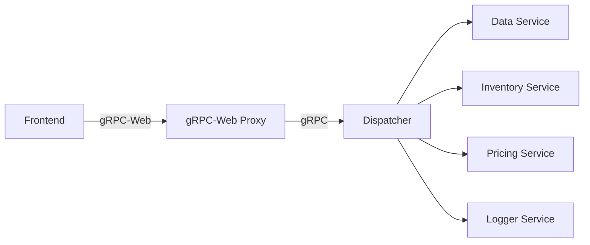

# Infrastructure Overview

This document describes the infrastructure and microservices that compose the system and how they interact.

## Components

| Service | Description | Exposed Port |
|---------|-------------|--------------|
| **frontend** | Vue 3 UI submitting orders through gRPC-Web. | 8081 |
| **grpcwebproxy** | Bridges gRPC-Web requests to native gRPC and forwards to dispatcher. | 8080 |
| **dispatcher** | Central service orchestrating calls to domain services. | 5000 |
| **data** | Persists order data. | 5001 |
| **inventory** | Tracks product availability. | 5002 |
| **pricing** | Provides pricing information. | 5003 |
| **logger** | Receives log messages. | 5004 |

## Interaction Flow

The frontend sends gRPC-Web requests to the proxy, which translates them into standard gRPC calls handled by the dispatcher. The dispatcher then coordinates with the other services to fulfill requests, persisting data, checking inventory, calculating prices, and emitting logs.

## Deployment

Docker Compose definitions in `docker-compose.yml` build each service into its own container and expose the ports listed above. Persistent data and logs are stored in named volumes `data` and `logs`.
